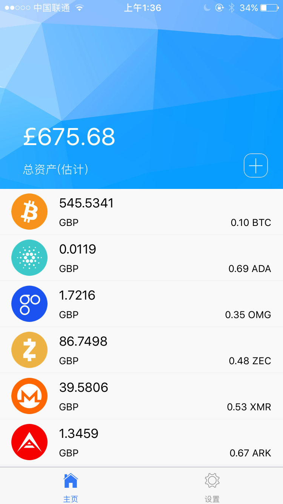
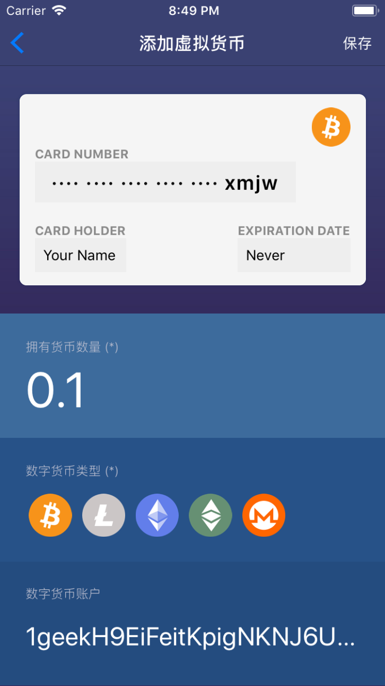

# Cryptocurrency Wallet

This is a cryptocurrency wallet app for Android and iOS, supporting for hundreds of cryptocurrencies. [中文页面](README-CN.md)

The wallet is based on React Native and Redux. The supporting features can be listed as below.

- [x] Adding, editing or deleting hundreds of cryptocurrencies
- [ ] Editing the base currency
- [x] Real-Time cryptocurrency infromation ,fetching from API
- [x] Data persistence

More features are going to be designed and implemented.

# Snapshot

